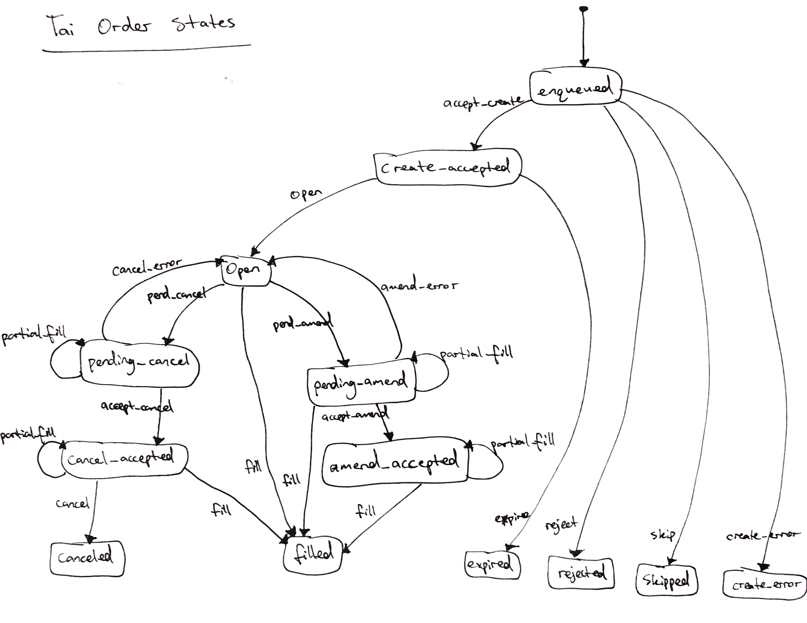

# Architecture

[Built with Tai](./BUILT_WITH_TAI.md) | [Install](../README.md#install) | [Usage](../README.md#usage) | [Commands](./COMMANDS.md) | [Architecture](./ARCHITECTURE.md) | [Examples](../apps/examples/README.md) | [Configuration](./CONFIGURATION.md) | [Observability](./OBSERVABILITY.md)

## Orders

## Advisors

Advisors are the brains of any `tai` application, they subscribe to changes in
market data to record and analyze data or execute automated trading strategies.

Orders are created and managed through a uniform API across exchanges, with
fast execution and reliability.

Take a look at some of the [examples](../apps/examples) to understand what
you can create with advisors.
